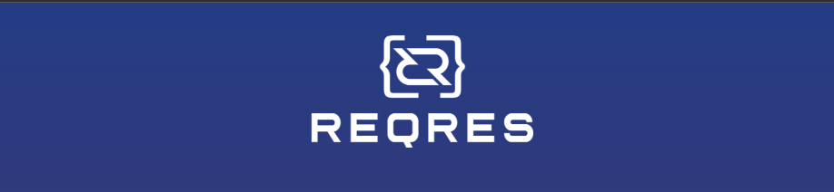
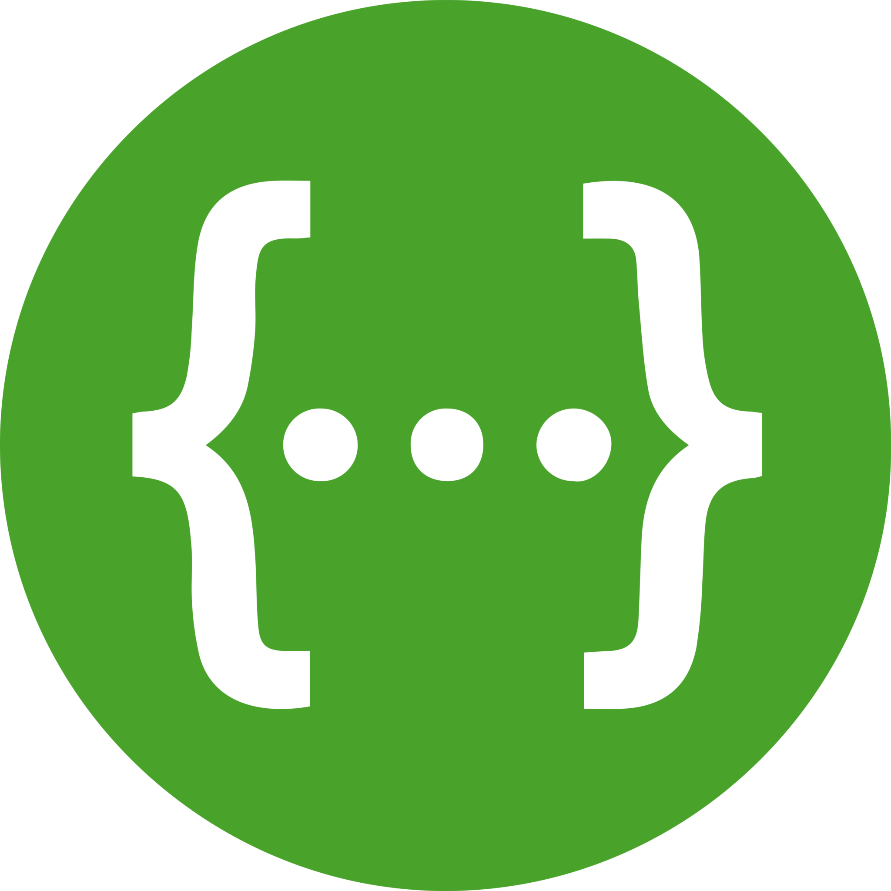

# Дипломный проект по тестированию API [reqres.in](https://reqres.in/)

  

## Содержание:
- [Реализованные проверки по тест-кейсам](https://github.com/Elena0808/diplom_ui#%D1%80%D0%B5%D0%B0%D0%BB%D0%B8%D0%B7%D0%BE%D0%B2%D0%B0%D0%BD%D0%BD%D1%8B%D0%B5-%D0%BF%D1%80%D0%BE%D0%B2%D0%B5%D1%80%D0%BA%D0%B8-%D0%BF%D0%BE-%D1%82%D0%B5%D1%81%D1%82-%D0%BA%D0%B5%D0%B9%D1%81%D0%B0%D0%BC)
- [Используемый стек](https://github.com/Elena0808/diplom_ui#%D0%B8%D1%81%D0%BF%D0%BE%D0%BB%D1%8C%D0%B7%D1%83%D0%B5%D0%BC%D1%8B%D0%B9-%D1%81%D1%82%D0%B5%D0%BA)
- [Сборка в Jenkins]()
- [Allure report]()
- [Пример прохождения тестов]()
## Реализованные проверки по тест-кейсам  
✓ Запрос списка пользователей  
✓ Создание пользователя при вводе валидных данных  
✓ Получаение пользователя по переданному id  
✓ Обновление пользователя  
✓ Удаление пользователя  
✓ Авторизация пользоввателя с переданными валидными данными  
✓ Ошибка авторизации с пустым обязательным полем password  

## Используемый стек

<code></code>
<code></code>
<code></code>
<code></code>
<code></code>
<code></code>
<code></code>
<code></code>

## Сборка в Jenkins
[Cсылка на проект в Jenkins](https://jenkins.autotests.cloud/job/C02-les0808-22-api/)

## Allure report
[Ссылка на отчет](https://jenkins.autotests.cloud/job/C02-les0808-22-api/9/allure)
